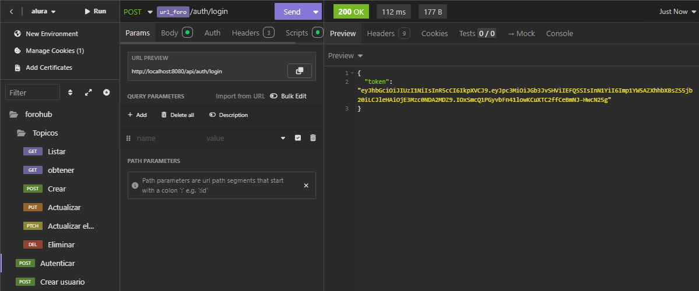
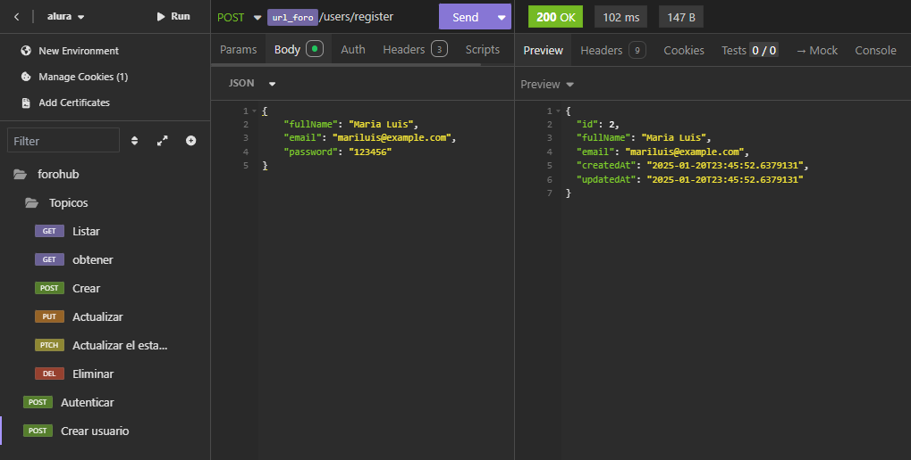
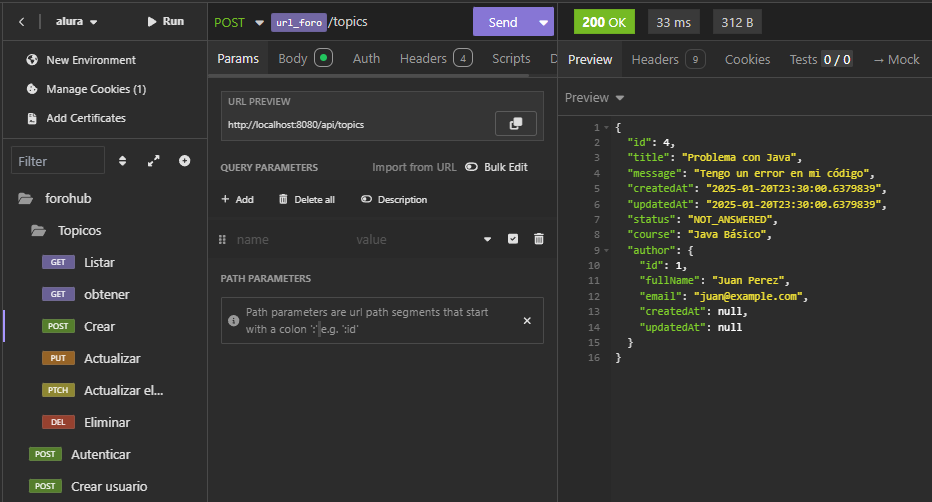
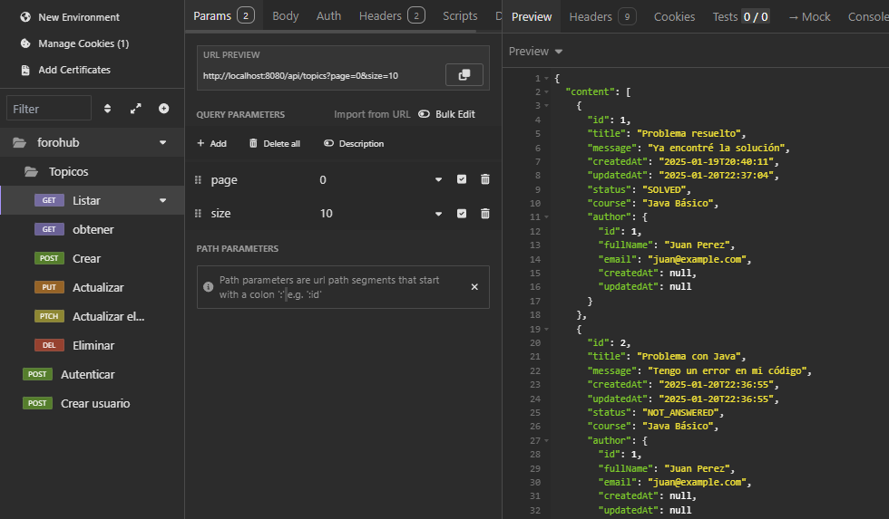
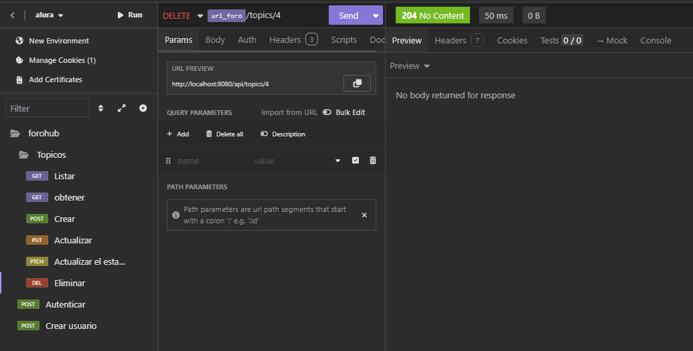

# ForoHub API
API REST para un foro de discusión desarrollado con Spring Boot 3.

## 🛠️ Tecnologías Utilizadas


- Java 17
- Spring Boot 3.4.1
- Spring Security + JWT
- Spring Data JPA
- MySQL
- Flyway para migraciones
- Maven

## ⚙️ Configuración

1. Crear base de datos MySQL:
```sql
CREATE DATABASE foro_alura;
```

2. Configurar application.properties:
```properties
spring.datasource.url=jdbc:mysql://localhost:3306/foro_alura
spring.datasource.username=root
spring.datasource.password=root
```

3. Ejecutar la aplicación:
```bash
./mvnw spring-boot:run
```

## Capturas del Proyecto

### Autenticar usuario


### Crear usuario


### Crear tópico


### Listado de Tópicos


### Eliminar Tópicos


## 📌 Endpoints

### Autenticación

1. Registrar usuario:
```bash
curl -X POST http://localhost:8080/api/users/register \
  -H "Content-Type: application/json" \
  -d '{
    "fullName": "Juan Perez",
    "email": "juan@example.com",
    "password": "123456"
  }'
```

2. Login:
```bash
curl -X POST http://localhost:8080/api/auth/login \
  -H "Content-Type: application/json" \
  -d '{
    "email": "juan@example.com",
    "password": "123456"
  }'
```

### Tópicos

1. Crear tópico:
```bash
curl -X POST http://localhost:8080/api/topics \
  -H "Authorization: Bearer {token}" \
  -H "Content-Type: application/json" \
  -d '{
    "title": "Problema con Java",
    "message": "Tengo un error en mi código",
    "course": "Java Básico"
  }'
```

2. Listar tópicos:
```bash
curl http://localhost:8080/api/topics?page=0&size=10
```

3. Ver tópico específico:
```bash
curl http://localhost:8080/api/topics/{id}
```

4. Actualizar tópico:
```bash
curl -X PUT http://localhost:8080/api/topics/{id} \
  -H "Authorization: Bearer {token}" \
  -H "Content-Type: application/json" \
  -d '{
    "title": "Problema resuelto",
    "message": "Ya encontré la solución",
    "course": "Java Básico"
  }'
```

5. Eliminar tópico:
```bash
curl -X DELETE http://localhost:8080/api/topics/{id} \
  -H "Authorization: Bearer {token}"
```

## ✨ Características

- Autenticación con JWT
- CRUD completo de tópicos
- Paginación de resultados
- Validación de datos
- Manejo global de excepciones
- Migraciones con Flyway
- Tests automatizados

## 📂 Estructura del Proyecto

```
src/
├── main/
│   ├── java/
│   │   └── com/alura/forohub/
│   │       ├── config/
│   │       ├── controller/
│   │       ├── dto/
│   │       ├── exception/
│   │       ├── model/
│   │       ├── repository/
│   │       ├── security/
│   │       └── service/
│   └── resources/
│       ├── db/migration/
│       └── application.properties
└── test/
    └── java/
        └── com/alura/forohub/
```

## 🔒 Seguridad

- Endpoints protegidos con Spring Security
- Tokens JWT para autenticación
- Contraseñas encriptadas con BCrypt
- Validación de tokens en cada request

### 🤝 Agradecimientos

- [Oracle ONE](https://www.oracle.com/br/education/oracle-next-education/) por la oportunidad de aprendizaje
- [Alura](https://www.aluracursos.com/) por el contenido educativo


## 🙋‍♀️ Sobre Mí 

Mi nombre es María Cámpora, estudiante en Alura. Estoy apasionada por la programación y en constante aprendizaje para crear proyectos que faciliten la vida de las personas.